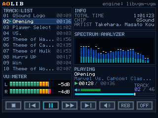
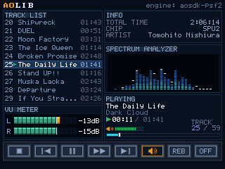

# AOLIB

A Libretro core for playing video game music in RetroArch, with a built-in
graphical interface: a browsable track list, VU meter, spectrum analyzer,
and playback controls.

It's not a console emulator — it's a player. Load a single file or a
`.zip`/`.7z` containing a whole album, and it plays it in order, with no
need for `.m3u` files.

## Supported formats

| Backend | Formats |
|---------|---------|
| libgme  | `.spc` `.nsf` `.nsfe` `.gbs` `.hes` `.kss` `.sap` `.ay` `.gym` |
| libvgm  | `.vgm` `.vgz` (30+ chips, including many arcade ones) |
| libxmp-lite | `.mod` `.s3m` `.xm` `.it` (tracker modules) |
| aosdk   | `.psf` `.minipsf` `.psf2` `.minipsf2` `.ssf` `.minissf` |
| vgmstream | `.xa` `.str` `.pxa` `.xai` `.vag` `.psh` `.npsf` `.adx` `.dsp` `.brstm` `.genh` |

The breakdown of which chip or format covers which system or arcade board is in
[SUPPORTED_SYSTEMS.md](SUPPORTED_SYSTEMS.md).

 

## Albums in `.zip` and `.7z`

The core opens the archive itself: it enumerates the entries, sorts them in natural order (9 Theme before 10 Theme), and plays them as an album. Shared library files (.psflib, .psf2lib, .ssflib) are resolved across entries in the same archive, but never show up as tracks. .7z support covers Store, LZMA and LZMA2; encrypted archives are not supported.

Two things worth knowing about how playback behaves:

Track changes don't interrupt the audio. For .zip albums the next entry is decompressed ahead of time, a slice per frame, while the current track plays. By the time the track ends, the next one is already in memory.
Track durations fill in as you listen. They're probed in the background instead of up front, so loading an album is immediate no matter how large it is. Until a track has been probed its length shows as --:--.
.7z behaves differently on purpose: it extracts the whole album while loading, rather than lazily like .zip. 7-Zip compresses in solid blocks.

## Controls

| Button | Action |
|--------|--------|
| Up / Down | Move the cursor through the list (repeats on hold) |
| Left / Right | Move focus across the deck |
| B | Plays the track under the cursor |
| A | Activates the focused deck button |
| L / R | Volume down / up |
| Start | Pause / resume |

The deck has eight buttons: stop, previous track, play/pause, fast
forward (hold to use), next track, volume, reverb, and repeat mode.
Volume, reverb, and repeat stay lit, with an orange border, until
toggled again.

## Core options

| Option | Values | Effect |
|--------|--------|--------|
| Loop forever at end of album | disabled / enabled | Restarts from the beginning once the last track ends |
| Fade duration (s) | 8, 0, 1, 2, 3, 5, 10 | Length of the final fade-out |
| SPU Reverb (PSF2 only) | enabled / disabled | Reverb of the emulated PlayStation SPU |
| Player Reverb Amount | 1, 2, 3 | Level (35%, 50%, 65%) of the player's own reverb |

The player's reverb is turned on and off **only** with the REB button on
the deck; the menu just sets the level it'll play at. These are two
different things: the SPU reverb is part of how the console actually
sounded, so it ships enabled; the player's reverb is an effect added on
top, and ships disabled.

## Building / Installation

Requires GNU Make and a C++17 compiler. All dependencies are vendored
under `deps/`; nothing else needs to be installed.

```sh
make all USE_PSF_ENGINE=1              # Linux   -> aolib_libretro.so
make all USE_PSF_ENGINE=1 PLATFORM=windows   # Windows -> aolib_libretro.dll
```

Cross-compiling for Windows requires `x86_64-w64-mingw32-g++`.

Run `make clean` when switching platforms: object files are named the
same on both, and Make has no way of knowing the compiler changed.

Without `USE_PSF_ENGINE=1` the core builds without the aosdk engines, and
the PSF and SSF formats are left out.

For releases, always use the packaging targets instead of copying
binaries by hand:

```sh
make dist          # builds from scratch and updates dist-linux/
make dist-windows  # same, for dist-windows/
make dist-all      # both platforms
```

`info` lives at the repo root (`aolib_libretro.info`, single source of
truth) and is copied into `dist-linux/`/`dist-windows/` by the packaging
targets. Edit the root copy, not the ones under `dist/`.

## Architecture

Three distinct lifetime layers: `CoreContext` is rebuilt on every
`retro_load_game()`, while `UiModel`, `AudioAnalyzer`, and `dsp::Reverb`
live for the whole RetroArch session. All file I/O goes through
`IVFSBridge`, without exception. The three aosdk engines (PSF1, PSF2, SSF)
share a single process-wide state guard, because the vendored R3000A and
M68000 cores don't support two live instances at once. The audio pipeline
applies reverb BEFORE the gain stage — so the tail rises with the overall
volume — and analyzes the signal AFTER, because the VU meter has to show
what's actually heard, not what the engine produced.

```
===================================================================================================
                                    AOLIB - core architecture
                     retro_run() per frame: input ──> state ──> audio ──> video
===================================================================================================

                                     ┌────────────────────────┐
                                     │  RetroArch (frontend)  │
                                     │ VFS · input · callbacks│
                                     └───────────┬────────────┘
                                                 │
                             . . . . . . . . . . │ . . (GET_VFS_INTERFACE)
                             .                   ▼
┌────────────────────────────.───────────────────────────────────────────────────────────────────┐
│ libretro.cpp – core entry point                                                                │
│                                                                                                │
│ ┌─ PROCESS STATE (survives every retro_load_game()) ─────────────────────────────────────────┐ │
│ │                                                                                            │ │
│ │  ┌──────────────────────┐     ┌────────────────────────┐     ┌──────────────────────────┐  │ │
│ │  │       UiModel        │     │     AudioAnalyzer      │     │        dsp::Reverb       │  │ │
│ │  │ focus · volume · rpt │     │  VU + spectrum (FFT)   │     │host layer, struct. bypass│  │ │
│ │  └──────────────────────┘     └────────────────────────┘     └──────────────────────────┘  │ │
│ └────────────────────────────────────────────────────────────────────────────────────────────┘ │
│                                                                                                │
│ ┌─ PER-CONTENT STATE / I/O ──────────────────────────────────────────────────────────────────┐ │
│ │                                                                                            │ │
│ │  ┌─ CoreContext (rebuilt) ──────┐     ┌────────────────────┐     ┌──────────────────────┐  │ │
│ │  │ CoreOptions · archive_is_7z  │     │     IVFSBridge     │     │  apply_ui_input()    │  │ │
│ │  │ zip_entries · prefetch · job │     │ (LibretroVFS) I/O  │     │  pad/keyboard->deck  │  │ │
│ │  │        │                     │     └─────────┬──────────┘     └──────────┬───────────┘  │ │
│ │  │        ▼                     │               │                           │              │ │
│ │  │ unique_ptr<IAudioEngine>     │               ▼                           ▼              │ │
│ │  └──────────────────────────────┘     ┌────────────────────┐     ┌──────────────────────┐  │ │
│ │                                       │ enumerate_zip/7z() │     │     ui::render()     │  │ │
│ │                                       │  natural order     │     │  320x240 XRGB8888    │  │ │
│ │                                       └─────────┬──────────┘     └──────────────────────┘  │ │
│ └─────────────────────────────────────────────────┼──────────────────────────────────────────┘ │
│                                                   │ construct_engine_for()                     │
│                                                   │ (vgmstream tried LAST: it claims generic   │
│                                                   │ extensions like .str that other engines    │
│                                                   │ should get first -- order is enforced by   │
│                                                   │ checkup.sh                                 │
│                                                   ▼                                            │
│ ┌─ AUDIO ENGINES (IAudioEngine) ─────────────────────────────────────────────────────────────┐ │
│ │                                                                                            │ │
│ │  ┌────────────────┐  ┌────────────────┐  ┌─── aosdk (process-wide guard) ────────────────┐ │ │
│ │  │   GmeEngine    │  │  LibvgmEngine  │  │ ┌──────────────┐ ┌──────────────┐ ┌─────────┐ │ │ │
│ │  │ SPC · NSF · GBS│  │ VGM · VGZ      │  │ │  PsfEngine   │ │  SsfEngine   │ │ Core    │ │ │ │
│ │  │ HES · KSS...   │  │ (30+ chips)    │  │ │ PSF1 / PSF2  │ │ SSF / Saturn │ │ Guard   │ │ │ │
│ │  └────────────────┘  └────────────────┘  │ └──────────────┘ └──────────────┘ └─────────┘ │ │ │
│ │  ┌────────────────┐                      │  acquire() -> bool: a busy guard FAILS        │ │ │
│ │  │  libxmp-lite   │                      │  THE TRACK LOAD, not the process.             │ │ │
│ │  │ .MOD.S3M.XM.IT │                      └───────────────────────────────────────────────┘ │ │
│ │  └────────────────┘                                                                        │ │
│ │                                                                                            │ │
│ │  ┌──── VgmstreamEngine (ISC, last in the chain) ────────────────────────────────────────┐  │ │
│ │  │  49 extensions / 45 parsers: XA · VAG/SVAG/VPK/MIB · ADX/AHX · GC-DSP/BRSTM          │  │ │
│ │  │  AST · NDS STRM · RIFF/GENH · EA SCHl · CAF · FSB · GCub · MSS · ETC.                │  │ │
│ │  │ ------------------------------------------------------------------------------------ │  │ │
│ │  │  vgmstream_api (facade) --> vgmstream_vfs_adapter (STREAMFILE<->IVFSBridge)          │  │ │
│ │  │  resample -> 44100 inside vgmstream; native rate in TrackMetadata                    │  │ │
│ │  └──────────────────────────────────────────────────────────────────────────────────────┘  │ │
│ └─────────────────────────────────────────────────┬──────────────────────────────────────────┘ │
│                                                   │ render()                                   │
│                                                   ▼                                            │
│ ┌─ EXECUTION PIPELINES (retro_run's real order) ─────────────────────────────────────────────┐ │
│ │                                                                                            │ │
│ │  [ AUDIO PIPELINE ]                                                                        │ │
│ │  ┌──────────┐      ┌──────────┐      ┌───────────┐      ┌──────────┐                       │ │
│ │  │  engine  │ ───> │  Reverb  │ ───> │ host gain │ ───> │ Analyzer │ ───> audio_batch_cb   │ │
│ │  │ ->render │      │(amount>0)│      │  volume   │      │  feed()  │                       │ │
│ │  └──────────┘      └──────────┘      └───────────┘      └──────────┘                       │ │
│ │   * Reverb BEFORE gain; Analyzer AFTER (VU shows what is actually heard)                   │ │
│ │                                                                                            │ │
│ │  [ BACKGROUND WORK -- after the audio is handed over, on purpose ]                         │ │
│ │  ┌──────────────────────────┐   ┌──────────────────────────┐                               │ │
│ │  │ advance_zip_prefetch()   │   │ advance_duration_probe() │                               │ │
│ │  │ inflates the NEXT entry, │   │ fills the track lengths  │                               │ │
│ │  │ ~4 ms/frame budget       │   │ the list shows, 2 ms/fr. │                               │ │
│ │  └──────────────────────────┘   └──────────────────────────┘                               │ │
│ │   The frontend paces the core by blocking inside audio_batch_cb(), so                      │ │
│ │   work placed after it uses slack that would otherwise go to vsync.                        │ │
│ │   Prefetch has priority: only ONE extra entry is ever in flight.                           │ │
│ │                                                                                            │ │
│ │  [ VIDEO PIPELINE ]                                                                        │ │
│ │  ┌──────────────┐      ┌──────────────┐      ┌──────────────┐                              │ │
│ │  │  pad input   │ ───> │   UiModel    │ ───> │ ui::render() │ ───> video_refresh_cb        │ │
│ │  │ apply_input  │      │focus/deck st.│      │ (idempotent) │                              │ │
│ │  └──────────────┘      └──────────────┘      └──────────────┘                              │ │
│ └────────────────────────────────────────────────────────────────────────────────────────────┘ │
└────────────────────────────────────────────────────────────────────────────────────────────────┘

 Module legend:
 [Process state]       : Persists across games (UiModel, AudioAnalyzer, dsp::Reverb)
 [Per-content state]   : Destroyed and rebuilt per ROM (CoreContext, IVFSBridge, Zip, Render)
 [Audio engines]       : Implement IAudioEngine (GME, LibVGM, libxmp, AOSDK, vgmstream)
 [I/O & bridges]       : Integration with the Libretro API
 [Archive readers]     : enumerate_zip() (minizip 1.3.1, Store/Deflate, Zip64) and
                         enumerate_7z() (7-Zip SDK, Store/LZMA/LZMA2) both fill the
                         same std::vector<ZipEntry> -- downstream code (duration probing,
                         track switching) never distinguishes .zip from .7z.
```
## Licensing

The project's own code belongs to Ckines, under GPL-2.0-or-later. The
compiled binary also links against third-party code under other licenses
(BSD, LGPL-2.1, GPL, and non-commercial licenses from MAME and Musashi).

## Credits

This is third-party work AOLIB depends on to function: the player itself
doesn't emulate anything on its own — it's an interface and a Libretro
bridge over what follows.

**Format.** [Neill Corlett](http://www.neillcorlett.com) designed the PSF
format itself (2003) and its successor PSF2, the basis SSF and the rest
of the "Portable Sound Format" family also derive from. None of his code
is vendored directly, but without his format there would be no PSF1,
PSF2, or SSF.

**[libgme](https://github.com/libgme/game-music-emu)** (SPC, NSF/NSFE,
GBS, HES, KSS, SAP, AY, GYM) — Shay Green. The YM2612 emulator (Sega
Genesis/Mega Drive) is by Stéphane Dallongeville.

**[libvgm](https://github.com/ValleyBell/libvgm)** (VGM/VGZ) —
ValleyBell. The chip cores this core enables come from MAME and from
independent projects: Nicola Salmoria (SN76496), Jarek Burczynski and
Ernesto Corvi (YM2413, YM3812), Mirko Buffoni, Aaron Giles, and Andrew
Gardner (OKIM6295 and the shared ADPCM decoder), Mitsutaka Okazaki
(AY8910/emu2149), superctr (Ian Karlsson) with Valley Bell (QSound),
R. Belmont, superctr, and Valley Bell (C219/C352), Olivier Galibert and
Aaron Giles (RF5C68), and Stéphane Dallongeville, Stéphane Akhoun, and
David Korth (PWM and RF5C164, from the Gens project lineage).

**[libxmp-lite](https://github.com/libxmp/libxmp)** (MOD, S3M, XM, IT) —
Claudio Matsuoka and Hipolito Carraro Jr, with Alice Rowan and Ozkan
Sezer maintaining it today.

**[vgmstream](https://github.com/vgmstream/vgmstream)** (all the streamed
formats in the table above: CD-XA, Sony VAG, CRI ADX/AHX, Nintendo
GC/Wii DSP and BRSTM, FMOD FSB, EA SCHl, Ubisoft Jade, and the rest) —
bnnm, kode54, Fastelbja, Ricardo Bravo and contributors, under an
ISC-style license. Only the parsers this core can actually reach are
vendored, computed automatically by `patches/vgmstream_closure.py`; the
exact upstream commit and every local patch are documented in
[Aolib/patches/VENDOR.md](deps/vgmstream/VENDOR.md) and
[Aolib/patches/README.md](deps/patches/README.md).)

**[aosdk](https://github.com/nmlgc/aosdk)** (PSF1, PSF2, SSF/Saturn) —
R. Belmont and Richard Bannister created the SDK; nmlgc maintains it
today. Within aosdk:

- PlayStation R3000A core (`psx.c`) — "smf", from the MAME project, with
  thanks to Farfetch'd for the delay-slot bug documentation used in its
  emulation.
- PSF1's SPU and PSF2's SPU2 (`peops`/`peops2`) — Pete Bernert.
- Saturn's SCSP (`scsp.c`) — ElSemi, with the MAME conversion and cleanup
  by R. Belmont, and additional fixes by kingshriek.
- Saturn's M68000 core ("Musashi") — Karl Stenerud.
- The PS1/PS2 engine itself (`psx.c`, `cpuintrf.h`, and related files) is
  distributed under the MAME license, copyright Nicola Salmoria and the
  MAME team.

**zlib & minizip** (.zip reading) — Jean-loup Gailly, Mark Adler, Gilles Vollant & Info-ZIP.

**7-Zip SDK** (.7z reading) — Igor Pavlov (Public Domain).
